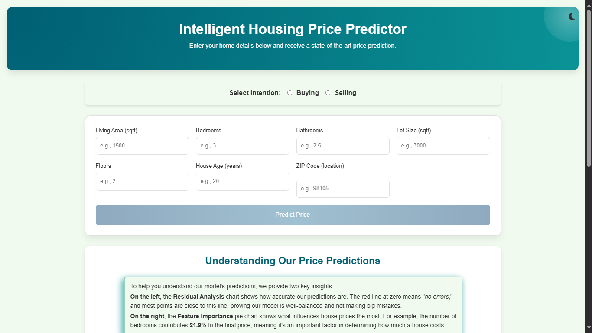
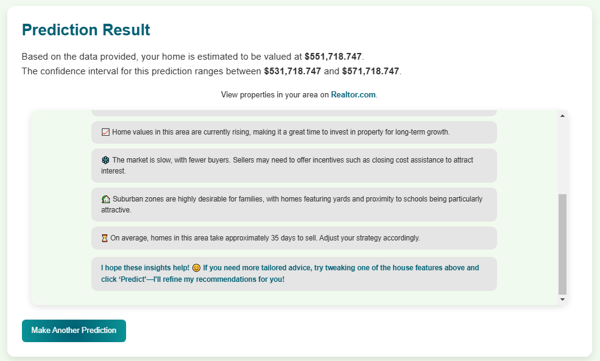
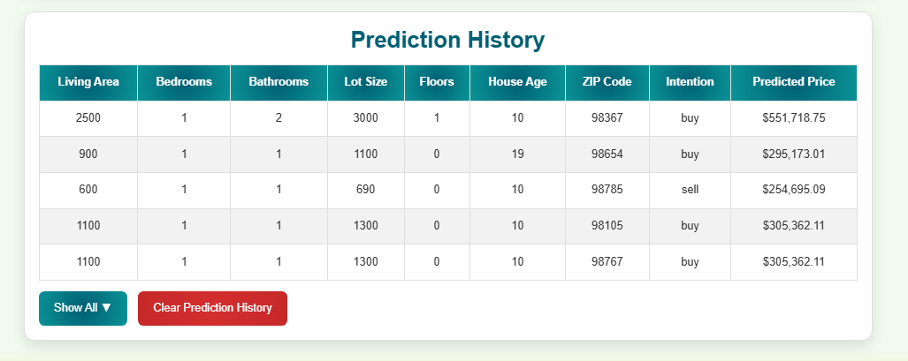
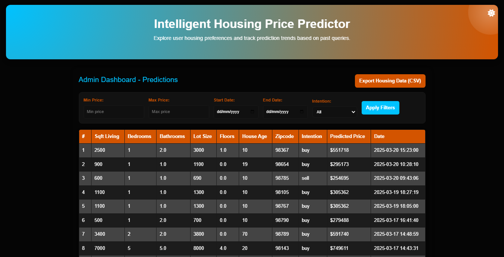
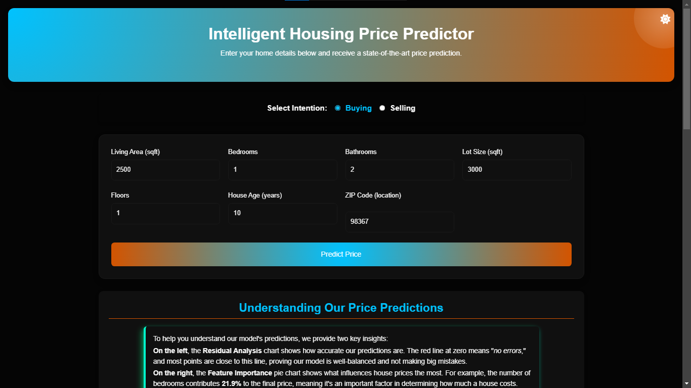

# Intelligent Housing Forecasting Model Using Machine Learning  

## Description  
The **Intelligent Housing Forecasting Model** is a machine learning-powered web application that predicts house prices based on user-input features. It utilizes **LightGBM**, a high-performance gradient boosting algorithm, to provide accurate price estimations with an **80% R² score**.  

Designed for both buyers and sellers, the system not only predicts home values but also offers **real-time market insights, tailored recommendations, and ZIP-code-based trends**, making it a valuable tool for real estate decisions.

## Features

-  **Accurate Housing Price Prediction** – Predicts house prices using a trained LightGBM model.  
-  **Confidence Interval Display** – Provides a price range to indicate prediction uncertainty.  
-  **Realtor.com Integration** – Generates a dynamic link to Realtor.com based on user-entered features.  
-  **AI-Powered Chatbot** – Offers tailored insights and recommendations for buyers and sellers.  
-  **Admin Dashboard** – Displays user input trends, filtering options (date, price, intent), and CSV data export.  
-  **User History Tracking** – Stores user inputs locally, persisting across sessions unless manually cleared.  
-  **Market Trends by ZIP Code** – Provides ZIP-specific insights, including price trends, competition, and location type.  
-  **Light/Dark Mode Toggle** – Allows users to switch between light and dark themes.  

## Installation  

Follow these steps to set up and run the project locally:  

### Prerequisites  
Ensure you have the following installed:  
- **Python 3.8+**  
- **pip (Python package manager)**  
- **Git** (optional, for cloning the repository)  


### 1. Clone the Repository  
```sh
git clone https://github.com/Kennedy178/predict_project.git
cd predict_project
```

### 2. Install Dependencies
```sh
pip install -r requirements.txt
```

### 3. Run the Application
```sh
python run.py
# The app will be accessible at: http://127.0.0.1:5000/
```

##  Usage: How to Use the Project

Follow these steps to interact with the **Intelligent Housing Forecasting Model Using Machine Learning**:

###  Accessing the System
1. **Open the Web App**  
   - Run the Flask server and open `http://127.0.0.1:5000/` in your browser.  
   - You will see the homepage with input fields for housing details.  
   -   

2. **Enter Property Details**
   - Select your intention: Are you looking to get a price estimate for a house you intend to buy or sell?
   - Fill in details such as ZIP code, house size, number of rooms, and purpose (buy/sell).
     
4. **Submit & Get Predictions**  
   - Click "Predict Price" to see the estimated house price.  
   - The system will display:
     - **Predicted Price**
     - **Confidence Interval (Price Range)**
     - **A dynamic link to Realtor.com** (to explore houses based on input)
     - **AI Chatbot for Insights & Recommendations**  
   -   

5. **User History Tracking**  
   - Your past inputs are stored in **Local Storage** and persist even after refreshing.  
   - Click "Clear History" if you want to reset.  
   -   

6. **Admin Dashboard (For Market Trends)**  
   - Open `http://127.0.0.1:5000/admin` or simply (Admin dashboard) link to view user preferences and housing trends.
   - This table fetches the stored user inputs and predictions from the database.  
   - Filter data based on **date, price range, and buy/sell intention**.  
   - Option to **download CSV reports** (filtered or full dataset).  
   -   

7. **Dark Mode Toggle**  
   - Click the 🌙/☀️ icon at the top-right corner to switch between dark and light mode.  
   -   

###  Enjoy Forecasting Housing Prices with AI! 🚀


